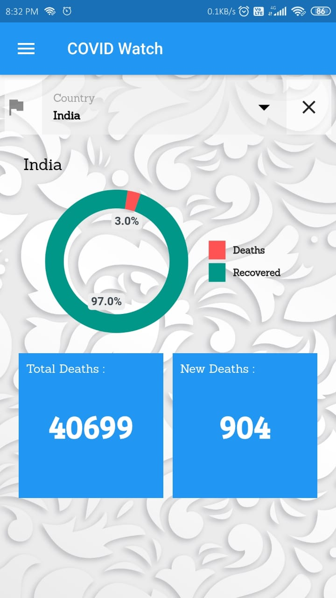

**<h1>COVIDWatch<h1>**
>This is a simple project made with flutter simply fetches the .json file from an api and displays the data of covid cases.
  
API used:
[Postman](https://www.postman.com/)
  
